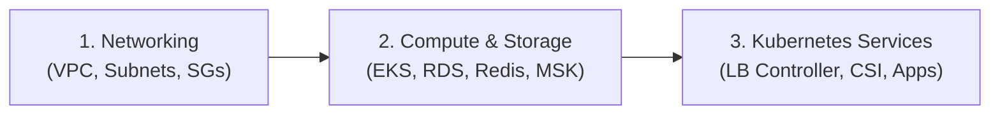

# AWS EKS Demo Infrastructure

Terraform-managed AWS infrastructure featuring an EKS cluster with managed node groups, RDS PostgreSQL, ElastiCache
Redis, and MSK Kafka.

## How to Run

### Prerequisites

- **AWS CLI:** Configured with credentials/role access to `us-east-2`.
- **Terraform:** Version `1.5+`.
- **Permissions:** Assume role ARNs for Dev/Prod environments.

### Initialize

```bash
terraform init
```

### Deploy (Dev)

```bash
terraform plan -var-file="env/dev.tfvars"
terraform apply -var-file="env/dev.tfvars"
```

### Deploy (Prod)

```bash
terraform plan -var-file="env/prod.tfvars"
terraform apply -var-file="env/prod.tfvars"
```

## Architecture

See detailed diagrams and component breakdown in [docs/architecture.md](docs/architecture.md).

## Key Decisions

- **Private Subnets & SG Isolation:** RDS, ElastiCache, and MSK in private subnets; ingress restricted exclusively to
  EKS Node SG.
- **KMS Encryption:** Centralized KMS key for RDS, ElastiCache, EKS secrets, and MSK storage at rest.
- **KRaft Mode for MSK:** Kafka 4.1.x.kraft to eliminate ZooKeeper dependency.
- **Environment Parity:** Dev/Prod share same tfvars structure; Prod enables Multi-AZ, deletion protection, and private
  EKS endpoint.

## What You Skipped and Why

This configuration provisions AWS infrastructure only. Kubernetes-native components are skipped to separate infrastructure from application lifecycles:

- **Load Balancer Controller & Ingress:** Handled by Helm/ArgoCD for dynamic routing.
- **EBS CSI Driver & Storage Classes:** Deployed as K8s addons for PVC provisioning.
- **Application Helm Charts:** Managed by CI/CD pipelines.

### Proposed Modular Split


