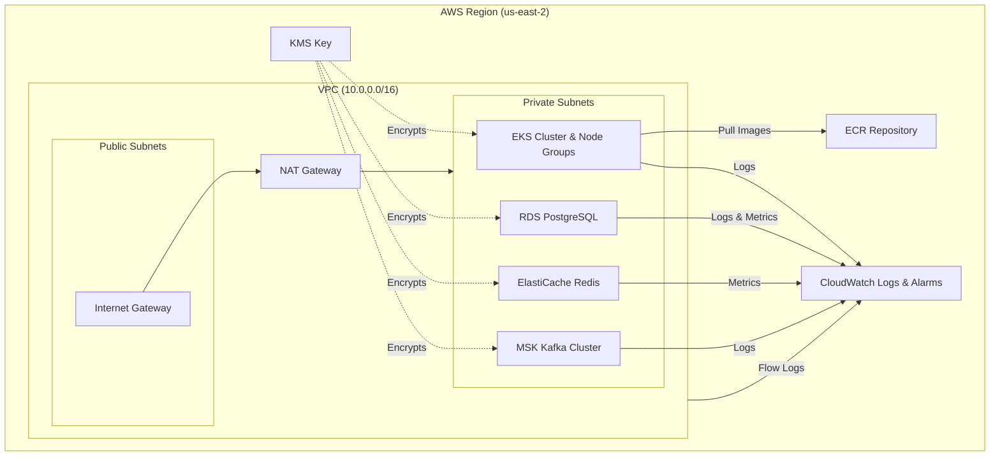
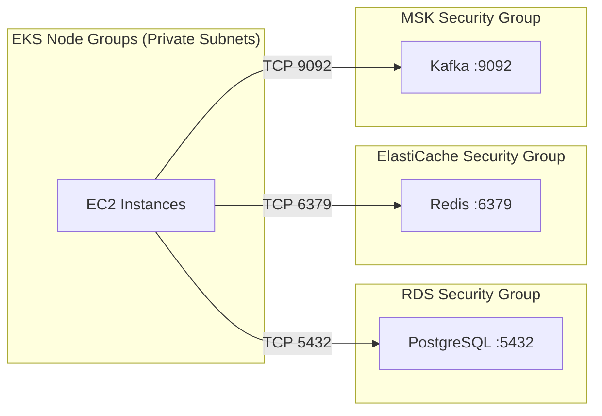

# AWS EKS Demo Architecture

## Infrastructure Overview

## Networking & Security Flow

## Component Details

| Component | Module Source | Description |
|-----------|---------------|-------------|
| **VPC** | `modules/vpc` | Custom VPC with public/private subnets, NAT GW, IGW, Flow Logs |
| **EKS** | `modules/eks` | Managed cluster with node groups, IMDSv2, encryption, CloudWatch alarms |
| **RDS** | `modules/rds` | PostgreSQL with encryption, backups, Multi-AZ (prod only) |
| **ElastiCache** | `modules/elasticache` | Redis with encryption, snapshots, Multi-AZ (prod only) |
| **MSK** | `modules/msk` | Kafka cluster (KRaft mode) with TLS encryption, CloudWatch logging |
| **ECR** | `terraform-aws-modules/ecr` | Container registry with lifecycle policy |
| **KMS** | `aws_kms_key.main` | Cross-cutting encryption key for all data stores |
| **Security Groups** | `terraform-aws-modules/security-group` | Per-service SGs allowing EKS node access only |

## Environment Differences

| Setting | Dev | Prod |
|---------|-----|------|
| RDS Multi-AZ | No | Yes |
| RDS Deletion Protection | No | Yes |
| RDS Skip Final Snapshot | Yes | No |
| Redis Multi-AZ | No | Yes |
| Redis Auto-Failover | No | Yes |
| EKS Public Access | Yes | No |
| Kafka Brokers | 2 | 3 |
| Log Retention | 7 days | 90 days |
| KMS Deletion Window | 7 days | 30 days |
